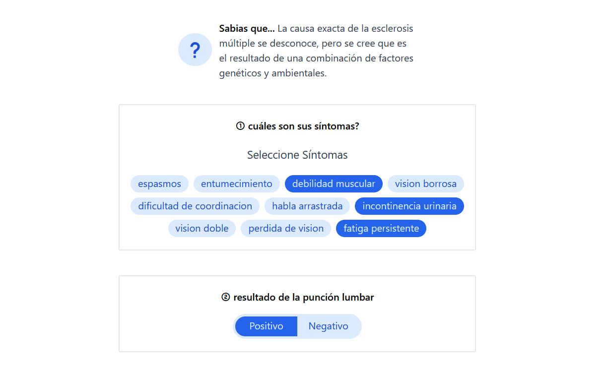
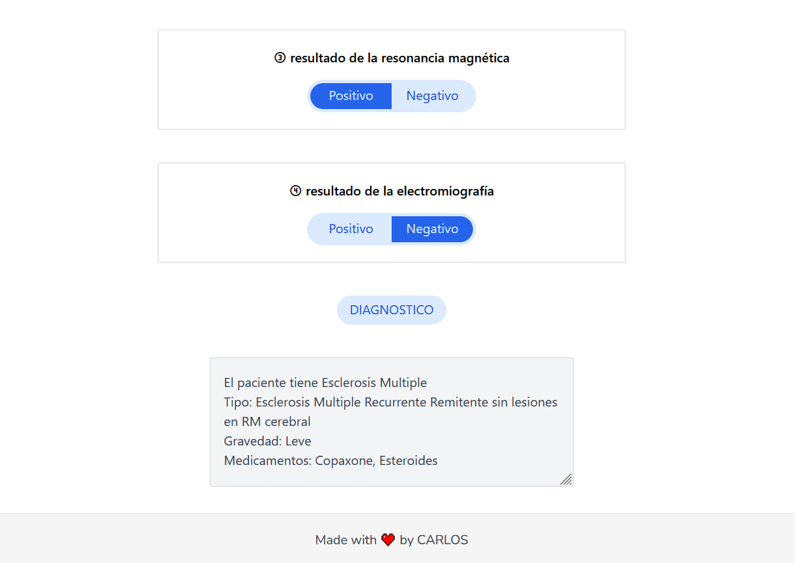

# Multiple Sclerosis Diagnosis
## Description
Small application to query a prolog program to diagnose patients with possible Multiple Sclerosis. Its made with Vue 3, TailwindCSS and Prolog. It should be clarified that the conclusions of the program have no medical validation of any kind. 

## Design



## Build Setup
```bash
# install dependencies
$ npm install

# serve with hot reload at localhost:5173
$ npm run dev
```

## Contribution
To contribute to this project please check out the [contribution guidelines](https://github.com/YurisCodingClub/accessibility-mentor/blob/main/CONTRIBUTING.md).
